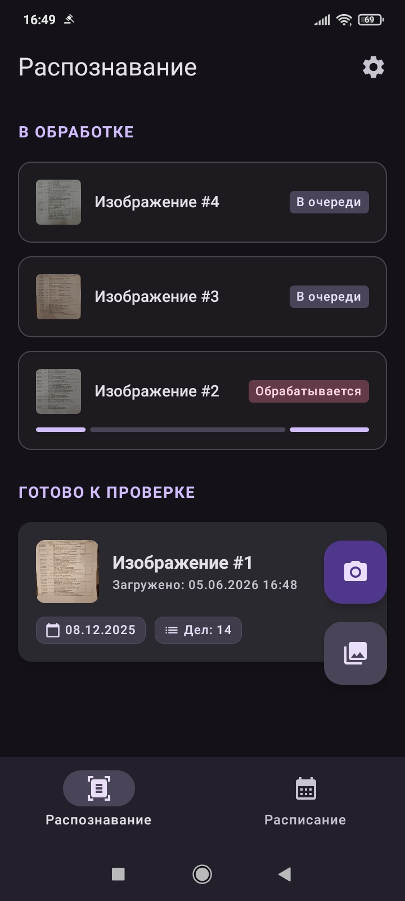
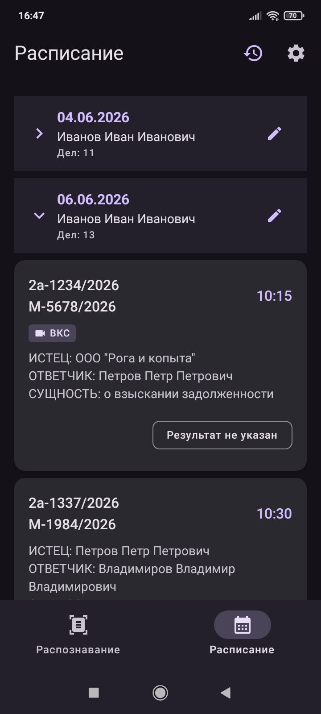

# CaseDocket

**CaseDocket** — это мобильное приложение для автоматизации работы с судебными расписаниями. Оно
позволяет преобразовывать фотографии печатных списков дел в структурированные данные с помощью OCR и
получать уведомления о заседаниях.

## 🖼️ Скриншоты

 <table style="width: 100%">
   <tr>
     <td style="width: 33%"></td>
     <td style="width: 33%"></td>
   </tr>
 </table>

## 📱 Основные возможности

* **OCR документов**: Распознавание русскоязычных таблиц и документов с использованием движка
  Tesseract.
* **Предобработка изображений**: Предварительная обработка фото (бинаризация, коррекция перспективы)
  с
  помощью OpenCV для повышения точности распознавания.
* **Уведомления**: Заблаговременные уведомления о предстоящих заседаниях с возможностью настройки
* **Управление данными**: Система черновиков и подтвержденных расписаний с возможностью ручного
  редактирования распознанной информации.

## 🚀 Установка

Скачайте и установите APK-файл: **[Releases](https://github.com/Chumakov123/case-docket/releases)**.
